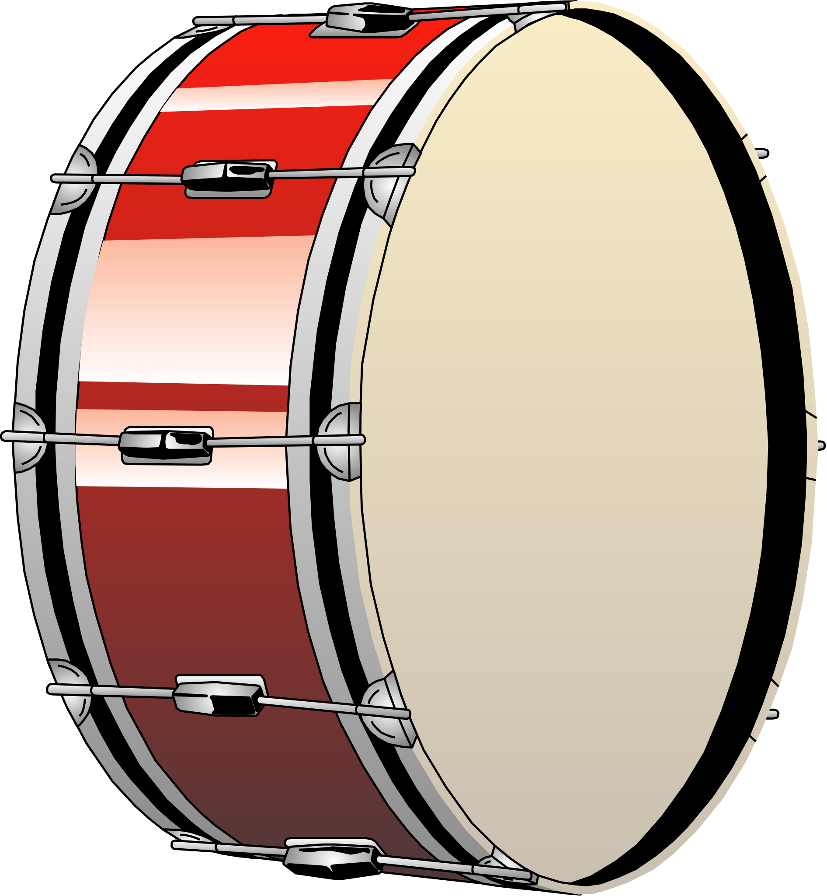
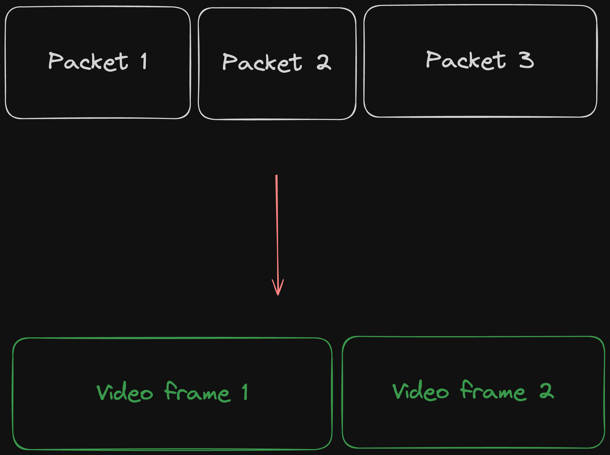
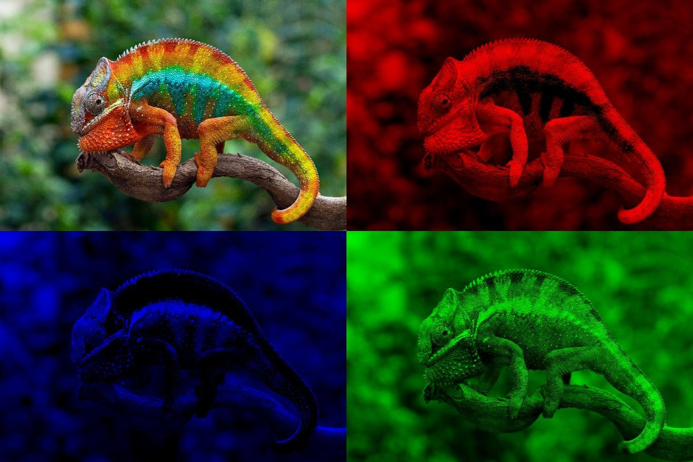
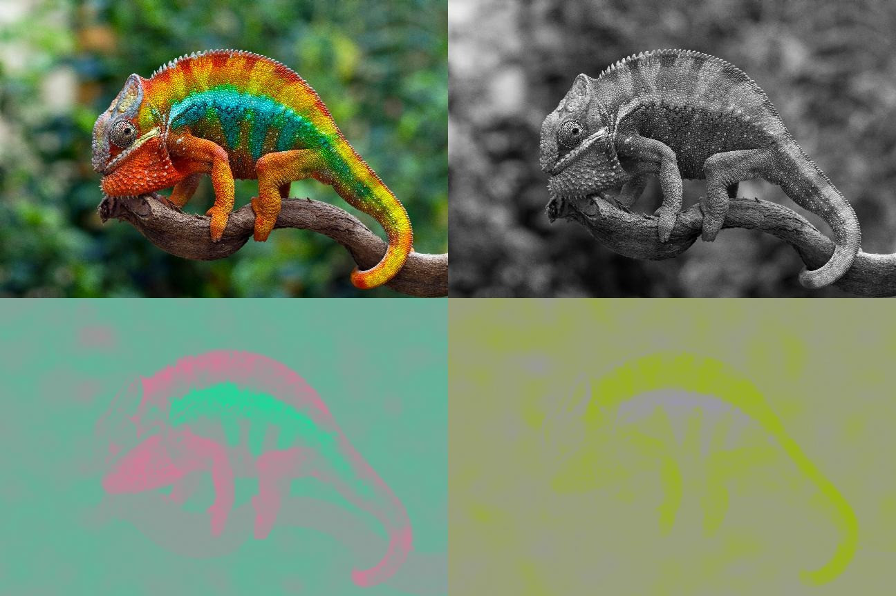

# Media streaming in the functional world

<h6 style="position:absolute;bottom:100px;">Mateusz Front</h6>

---

# How do you stream media in Elixir?

### 

---

# How do you stream media in Elixir?

### Let's solve a real-life problem! Or kind of...

---

## Drum

---

## Drum

+ It does bam bam

---

## Drum

+ It does bam bam
- It takes a lot of space

---

## Small drum == not cool

---

## Digital drum == too expensive

---

# Let's make a virtual drum!

---

---

- Record hand movements with camera

---

- Record hand movements with camera
- Stream it over WebRTC

---

- Record hand movements with camera
- Stream it over WebRTC
- Detect hand position with AI

---

- Record hand movements with camera
- Stream it over WebRTC
- Detect hand position with AI
- Emit _bam_ whenever hand moves down

---

- Record hand movements with camera
- Stream it over WebRTC
- Detect hand position with AI
- Emit _bam_ whenever hand moves down
- Stream the sound back

---

## Project Bam Bam - client

- Use `getUserMedia` to get the video from the browser

---

## Project Bam Bam - client

- Use `getUserMedia` to get the video from the browser
- Use JS WebRTC API to send it to the server

---

## Project Bam Bam - client

- Use `getUserMedia` to get the video from the browser
- Use JS WebRTC API to send it to the server
- Use JS WebRTC API to receive audio from the server

---

## Project Bam Bam - client

- Use `getUserMedia` to get the video from the browser
- Use JS WebRTC API to send it to the server
- Use JS WebRTC API to receive audio from the server
- Put it into the HTML `<audio/>` element

---

## Project Bam Bam - server ingress

- Receive video over WebRTC

---

## Project Bam Bam - server ingress

- Receive video over WebRTC
- Parse the video

---

## Project Bam Bam - server ingress

- Receive video over WebRTC
- Parse the video

---

## Project Bam Bam - server ingress

- Receive video over WebRTC
- Parse the video
- Decode the video

---

## Project Bam Bam - server ingress

- Receive video over WebRTC
- Parse the video
- Decode the video
- Convert the video from YUV to RGB

---

## Project Bam Bam - server ingress

- Receive video over WebRTC
- Parse the video
- Decode the video
- Convert the video from YUV to RGB

<footer>Image source: https://deeprender.ai/blog/yuv-colour-and-compression</footer>

---

## Project Bam Bam - server ingress

- Receive video over WebRTC
- Parse the video
- Decode the video
- Convert the video from YUV to RGB

<footer>Image source: https://deeprender.ai/blog/yuv-colour-and-compression</footer>

---

## Project Bam Bam - server ingress

- Receive video over WebRTC
- Parse the video
- Decode the video
- Convert the video from YUV to RGB
- Detect hand movement

---

## Project Bam Bam - server egress

- Generate BAM sounds

---

## Project Bam Bam - server egress

- Generate BAM sounds
- Fill gaps with silence

---

## Project Bam Bam - server egress

- Generate BAM sounds
- Fill gaps with silence
- Encode the audio

---

## Project Bam Bam - server egress

- Generate BAM sounds
- Fill gaps with silence
- Encode the audio
- Send the audio via WebRTC

---

# Let's get to it!

---

## Project Bam Bam - outcomes

- With WebRTC we can stream media at very low latency
- Membrane helps accessing and manipulating media in a functional way
- Elixir makes parallelism manageable
- Bridging media streaming with AI opens up a ton of possibilities

---

## WebRTC & low latency

&nbsp; | Sending a file | Low-latency media streaming
-- | -- | --
Packet loss | Always retransmit | Maybe drop it, FEC
Congestion decection | On packet loss | Constant monitoring 
Recovering from congestion | Slow down | Reduce quality
Transport protocol | TCP | Custom stack on top of UDP

---

